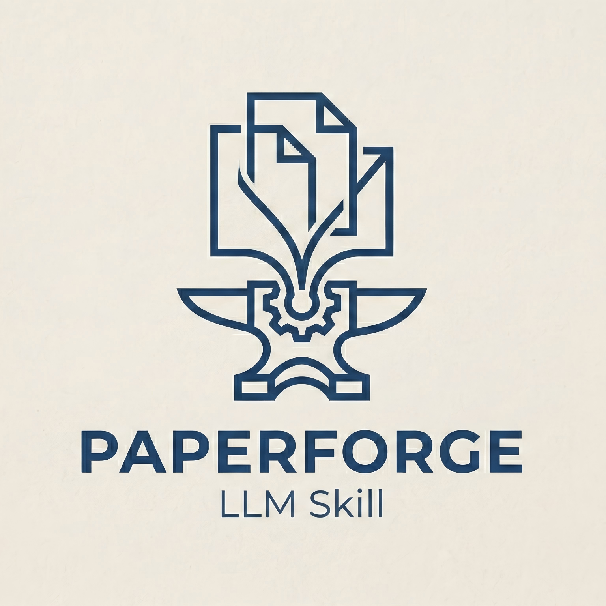
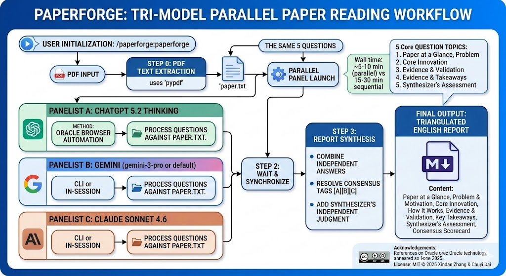
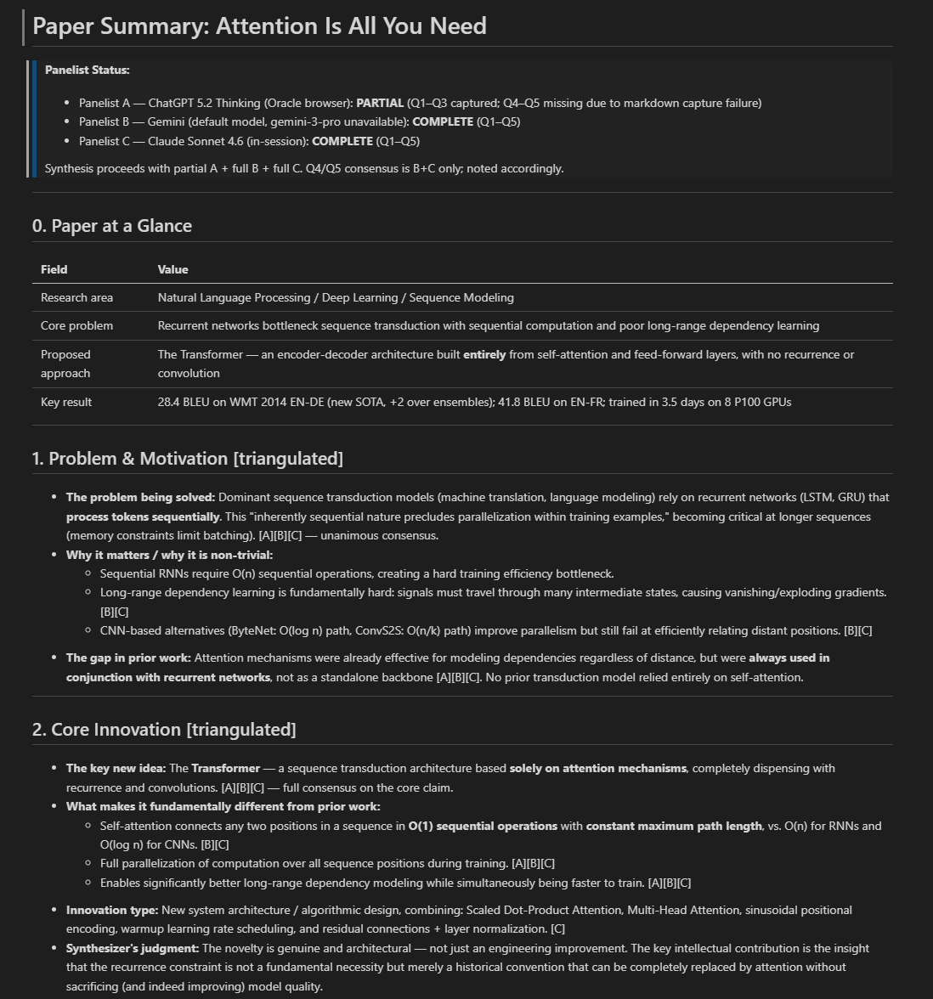
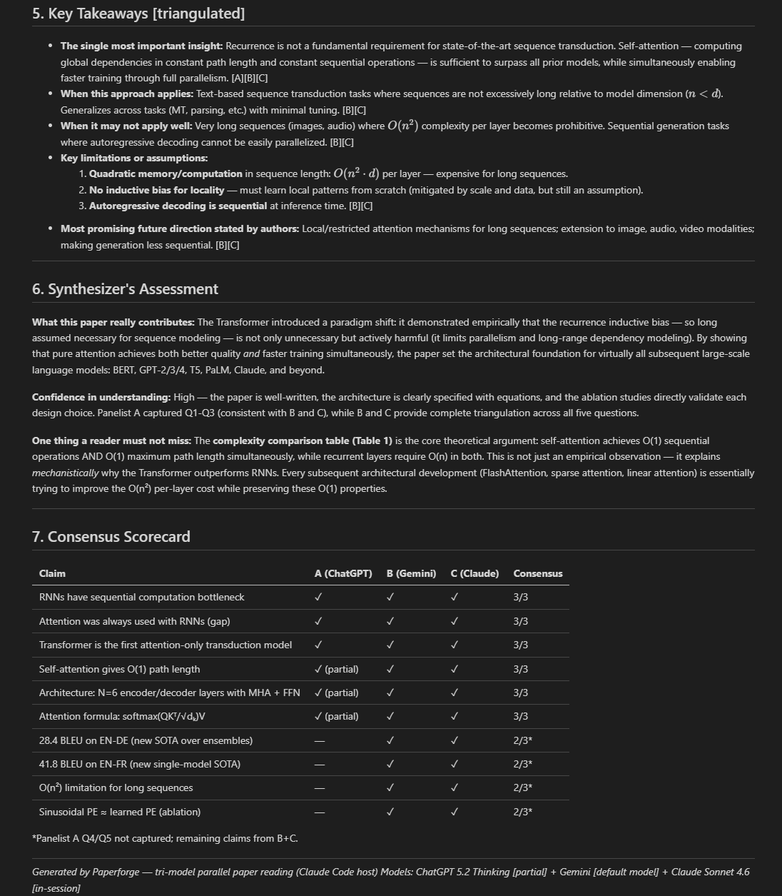

<div align="center">
  

# Paperforge SKILL

> Tri-model parallel paper reading: ChatGPT, Gemini, and Claude analyze any academic paper simultaneously, then synthesize into one triangulated English report.

</div>

## Install (Claude Code)

```shell
/plugin marketplace add Nitrogen216/paperforge
/plugin install paperforge@paperforge
```

Then analyze any paper:

```shell
/paperforge:paperforge
```

## Install (Codex CLI)

```bash
mkdir -p ~/.codex/skills/paperforge
curl -fsSL https://raw.githubusercontent.com/Nitrogen216/paperforge/main/skills/paperforge/SKILL.md \
  -o ~/.codex/skills/paperforge/SKILL.md
```

## What It Does

Paperforge sends **the same 5 questions** to three AI models **simultaneously**, then synthesizes their independent answers into a single report with consensus scoring.



| Panelist | Model | Method |
|----------|-------|--------|
| A | ChatGPT 5.2 Thinking | Oracle browser (always) |
| B | Gemini (gemini-3-pro or default) | CLI or in-session |
| C | Claude Sonnet 4.6 | CLI or in-session |

**Wall time:** ~5–10 min (parallel) vs. 15–30 min sequential.

The five questions cover: Problem & Motivation, Core Innovation, How It Works, Evidence & Validation, and Takeaways & Limitations — generic enough to apply to any paper type (empirical ML, theory, systems, survey, HCI, etc.).

## Output Format

A structured Markdown report with:

- **Paper at a Glance** — research area, core problem, approach, key result
- **Problem & Motivation** — triangulated [A][B][C] with consensus tags
- **Core Innovation** — triangulated, with synthesizer's independent judgment
- **How It Works** — step-by-step, key equations rendered in `$$...$$`
- **Evidence & Validation** — concrete numbers, dataset names, theorem names
- **Key Takeaways** — limitations and future directions
- **Synthesizer's Assessment** — confidence level and what not to miss
- **Consensus Scorecard** — table of key claims vs. each panelist

## Examples

The following screenshots show Paperforge's output when analyzing **"Attention Is All You Need"** (Vaswani et al., 2017 — the Transformer paper).

**Report header — Paper at a Glance, Problem & Motivation, Core Innovation:**



**Report tail — Key Takeaways, Synthesizer's Assessment, Consensus Scorecard:**



## Requirements

| Tool | Purpose | Install |
|------|---------|---------|
| [Oracle](https://github.com/steipete/oracle) by [@steipete](https://github.com/steipete) | ChatGPT via browser automation (Panelist A) | `npm install -g @steipete/oracle` |
| Gemini CLI | Panelist B | [google.dev/gemini-api/docs/gemini-api-overview](https://ai.google.dev/) |
| Claude Code or `claude` CLI | Panelist C | [claude.ai/code](https://claude.ai/code) |
| Python + `pypdf` | PDF text extraction | `pip install pypdf` |

## Authors

Paperforge was created by:

- **Xindan Zhang** — [xindan.zhang@mail.utoronto.ca](mailto:xindan.zhang@mail.utoronto.ca)
- **Chuyi Dai** — [cydai216@gmail.com](mailto:cydai216@gmail.com)

## Acknowledgements

Paperforge relies on [**Oracle**](https://github.com/steipete/oracle) by [**Peter Steinberger (@steipete)**](https://github.com/steipete) for browser automation that drives ChatGPT. Oracle handles Chrome profile management, model selection, file attachment, and response capture — capabilities that make Panelist A possible. We are grateful for Peter's work in building and open-sourcing Oracle.

> Oracle is distributed under its own license. Please refer to the [Oracle repository](https://github.com/steipete/oracle) for its terms of use before using Paperforge in commercial or redistributed contexts.

## License

MIT © 2025 Xindan Zhang & Chuyi Dai
